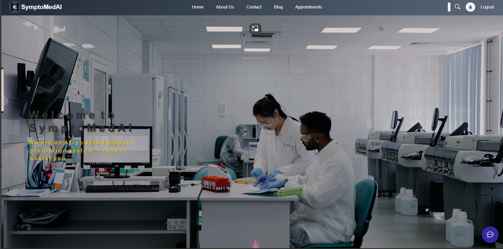

# 🤖 SymptoMedAi – AI-Powered Symptom Checker & Appointment Booking System
## 🖼️ Website Screenshot


SymptoMedAi is an AI-integrated health assistant that allows users to:
- 🧠 Predict diseases based on symptoms.
- 💬 Interact with a medical chatbot for guidance.
- 📅 Book doctor appointments based on AI feedback.

This system is built to make healthcare more accessible, especially in native languages like Tamil, and to bridge the gap between patients and medical professionals using technology.

---

## 🚀 Features

### 🩺 Disease Prediction
- Input symptoms, and the AI model predicts potential diseases.
- Trained using multiple ML models like Random Forest and SVM.

### 💬 AI Chatbot
- An interactive assistant to answer basic medical queries and guide users.
- Integrated into the frontend via a chatbot interface.

### 🧑‍⚕️ Appointment Booking
- Based on predictions or chatbot feedback, users can book appointments with doctors.
- Includes user login, registration, and profile pages.

---

## 📂 Project Structure
"""SymptoMedAi/
│
├── Scripts/ # Python scripts
├── static/ # Static assets (CSS, JS, Images)
├── templates/ # HTML templates
│ ├── index.html # Home page
│ ├── chatbot.html # Chatbot interface
│ ├── book_appointment.html # Booking page
│ ├── login.html # Login form
│ ├── register.html # Registration form
│ ├── profile.html # User profile
│ └── ... # Other pages (about, contact, etc.)
│
├── main.py # Main backend server (Flask or similar)
├── Medicine Recommendation System.ipynb # Jupyter notebook for ML
├── nithil_rf.pkl # Trained Random Forest model
├── nithil_svc.pkl # Trained SVC model
├── *.csv # Data files (symptom-severity, medications, etc.)
├── sympto.png # Logo or banner image
├── README.md # You're here!
└── pyvenv.cfg # Virtual environment config"""

## 🧠 Machine Learning

Trained on medical datasets like:
- `Training.csv`
- `Symptom-severity.csv`
- `description.csv`
- `precautions_df.csv`
- `medications.csv`
- `diets.csv`
- `workout_df.csv`

ML Models:
- ✅ `Random Forest` – Main classifier for disease prediction.
- ✅ `Support Vector Classifier (SVC)` – For performance comparison and backup.

---

## 🛠️ Technologies Used

- **Frontend:** HTML, CSS, JavaScript (basic, Bootstrap)
- **Backend:** Python, Flask
- **ML Libraries:** pandas, sklearn, joblib
- **Chatbot Logic:** Python/Flask-based, custom script
- **Database:** CSV-based (or SQLite if extended)

---

## 💻 How to Run the Project

1. **Clone the repo**

```bash
git clone https://github.com/nithiljn/SymptoMedAi.git
cd SymptoMedAi
Create & activate virtual environment

bash
Copy
Edit
python -m venv venv
source venv/bin/activate  # On Windows: venv\Scripts\activate
Install dependencies

bash
Copy
Edit
pip install -r requirements.txt  # Create this file if not present
Run the app

bash
Copy
Edit
python main.py
Visit: http://127.0.0.1:5000/

📸 Screenshots
(Include screenshots of home page, chatbot, disease prediction, appointment form, etc.)

🙋‍♂️ Developed By
James Nithil
AI & Full-Stack Developer
nithiljn24@gmail.com


